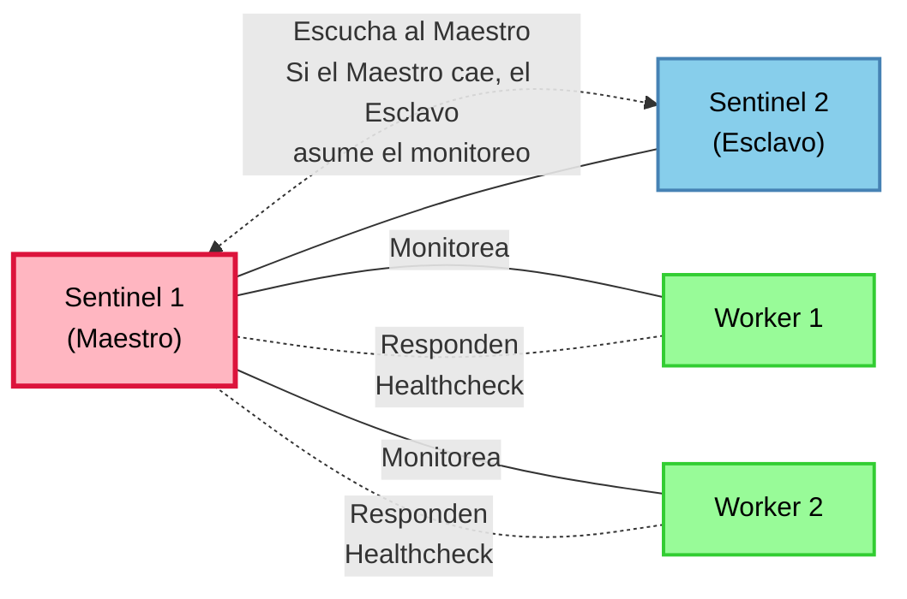
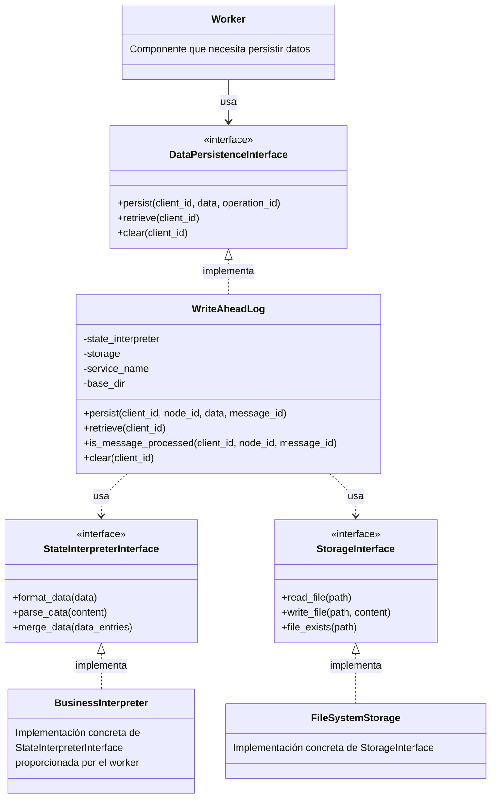

# Sistema de Tolerancia a Fallos para Aplicación Distribuida

## Ejecucion

### Correr el sistema

Para correr el sistema, primero debes generar un archivo de docker compose:
`./docker-compose.sh -q`

Esto generará un archivo `docker-compose-test.yaml` que contiene la configuración de todos los servicios necesarios para el sistema (incluyendo la Q5 por el flag -q).

Luego, puedes iniciar el sistema con el siguiente comando:
`run.sh --no-demo`

Esto iniciará todos los servicios definidos en el archivo `docker-compose-test.yaml`, incluyendo los workers, sentinelas y la base de datos sin estar matando servicios.

Para correrlo con la demo de tolerancia a fallos (matar servicios), puedes usar:
`run.sh`

Para luego chekear el resultado (con Q5), se puede correr el siguiente comando:
`./check_output.sh -q5`

Sin Q5, se puede correr:
`./check_output.sh`

Aclaracion: Los resultados que chequea el script `check_output.sh` estan basados en los dataset de movies, credits y ratings_small completos.

### Levantar nuevos clientes

Para levantar nuevos clientes usar el siguiente comando:
`docker compose -f docker-compose-test.yaml --profile manual up <client_container_name>`

Example
`docker compose -f docker-compose-test.yaml --profile manual up client4`

Esto permite:

- Mantener los servicios opcionales en el archivo principal de Compose.
- Iniciarlos solo cuando sea necesario.
- Asegurarse de que estén correctamente conectados a la misma red Docker que otros servicios.
- Mantener la consistencia de las variables de entorno y los montajes de volumen.

<br/><br/><br/>

# Sistema para reinicio de nodos caídos

## Visión General

El sistema consiste en servicios worker que realizan las queries y servicios sentinel que monitorean a los workers bajo una arquitectura maestro-esclavo. Cuando se detectan fallos, el sistema reinicia automáticamente los componentes fallidos para mantener la disponibilidad del servicio.



## Arquitectura

### Nodos

1. **Workers**: Nodos que realizan las queries y usan la interfaz **SentinelBeacon** para comunicarse con el sentinela maestro.
2. **Sentinelas**: Nodo de monitoreo que verifica la integridad de los workers através de una comunicación por socket. A la par los esclavos mmonitorean la integridad del maestro.

### Características del Diseño

#### 1. Arquitectura Maestro-Esclavo

Los sentinelas se monitorean entre sí utilizando una arquitectura maestro-esclavo a través de una conexión por socket TCP:

- Un sentinela actúa como maestro, responsable del monitoreo de todos los workers.
- Los otros sentinelas actúan como esclavos, recibiendo los broadcast de health check del maestro.
- Si algun esclavo falla, el sentinela maestro, lo detecta y lo revive.
- Si el maestro falla, los esclavos lo detectan e inician una nueva elección de líder.
- El nuevo maestro asume la responsabilidad de monitorear los workers y reinicia al sentinela maestro anterior

#### 2. Algoritmo de Elección de líder (Bully)

Se implementa un algoritmo tipo bully para la elección del maestro:

- Los sentinelas utilizan IDs únicos para determinar el liderazgo
- El ID más alto es elegido como el líder.
- Las elecciones se desencadenan cuando se detecta un fallo del maestro

## Detalles de Implementación

### Estructura del Código

#### 1. Clase Sentinel

El servicio principal de monitoreo que:

- Monitorea la salud de los workers
- Participa en la elección del maestro
- Reinicia workers y sentinelas fallidos

Métodos principales:

- `_check_worker_health(worker_host, worker_port)`: Verifica la salud del worker mediante conexión TCP
- `restart_worker(worker_host)`: Utiliza la API de Docker para reiniciar contenedores de worker fallidos
- `restart_sentinel(sentinel_hostname)`: Reinicia contenedores de sentinela fallidos
- `_initiate_election()`: Inicia el proceso de elección de maestro
- `_process_election_results()`: Determina el ganador de la elección y anuncia el nuevo maestro

#### 2. Clase SentinelBeacon

Una interfaz importada en cada worker, el cuál recibe las conexiones del sentinela maestro y le contesta los health checks:

- Escucha en un puerto designado
- Responde a las solicitudes de verificación de salud de los sentinelas

Métodos principales:

- `_run_sentinel_server()`: Ejecuta un servidor socket TCP para responder a los health checks.
- `_handle_sentinel_client(client_socket, addr)`: Procesa solicitudes entrantes de verificación de salud.

#### 3. Protocolo de Comunicación

Los sentinelas se comunican utilizando un protocolo de mensajería simple con tipos de mensajes:

- `ELECTION_START`: Inicia una elección de líder
- `ELECTION_RESPONSE`: Respuesta a un anuncio de elección de líder
- `LEADER_ANNOUNCEMENT`: Declara el maestro recién elegido
- `LEADER_HEARTBEAT`: Mensaje periódico del maestro a los esclavos
- `HEARTBEAT_ACK`: Confirmación de heartbeat de los esclavos
- `ID_ANNOUNCE`: Notificación de la presencia e ID de un sentinela para presentarse entre ellos.

### Monitoreo de Salud

#### Verificaciones de Salud de Workers

- Los sentinelas se conectan a los workers a través de un socket TCP (SentinelBeacon)
- Cada worker expone un puerto específico configurado en el docker compose. El cuál acepta las conexiones del Sentinela maestro.
- Los sentinelas envían un mensaje de heartbeat y esperan una respuesta.
- Un fallo de conexión o tiempo de espera agotado indica que el worker no está saludable, y debe de ser reiniciado.
  - Intenta reiniciar el container del worker utilizando la API de Docker.

#### Verificaciones de Salud de Sentinelas

- El maestro envía heartbeats periódicos a los sentinelas esclavos.
- Los esclavos escuchan los heartbeats del maestro.
- Si los heartbeats se detienen, los esclavos inician una nueva elección de líder.
- El nuevo líder reinicia el sentinela caido (previo líder).

### Implementación de los health checks

- Monitoreo secuencial de los workers que tiene asignado.
- Procesamiento concurrente de heartbeats de sentinela.
- Operaciones de verificación de salud no bloqueantes para los sentinelas esclavos.

## Configuración

El sistema de tolerancia a fallos se configura a través de variables de entorno en el archivo Docker Compose:

- `WORKER_HOSTS`: Lista de nombres de host de los workers a monitorear
- `WORKER_PORTS`: Lista de puertos para verificaciones de salud de los workers
- `CHECK_INTERVAL`: Frecuencia de las verificaciones de salud en segundos
- `SERVICE_NAME`: Nombre del servicio sentinela (usado para descubrimiento)
- `PEER_PORT`: Puerto para comunicación entre sentinelas
- `RESTART_ATTEMPTS`: Número de verificaciones fallidas antes del reinicio
- `RESTART_COOLDOWN`: Tiempo en segundos a esperar entre intentos de reinicio
- `COMPOSE_PROJECT_NAME`: Nombre del proyecto Docker Compose

## Conclusión

Este sistema de tolerancia a fallos proporciona una solución robusta para mantener la disponibilidad del servicio en una aplicación distribuida.

1. **Detecta y Recupera de Fallos**: El sistema puede detectar automáticamente y reiniciar workers fallidos, manteniendo la disponibilidad del servicio incluso durante fallos de componentes.

2. **Elimina Puntos Únicos de Fallo**: A través de la arquitectura maestro-esclavo y el mecanismo de elección, el sistema de monitoreo es resiliente frente a fallos.

3. **Asegura un Monitoreo Consistente**: El protocolo de elección de maestro garantiza que exactamente un sentinela sea responsable de las verificaciones de salud de los workers y su recuperación en cualquier momento.

4. **Ofrece Flexibilidad de Despliegue**: El sistema actualmente utiliza a Docker para reiniciar los nodos caidos, pero dado que la detección no depende de Docker en sí, se puede desacoplar el uso de Docker a favor de otra tecnología.

<br/><br/><br/>

# Persistencia de Datos (Write-Ahead Log)

## Visión General

El Write-Ahead Log (WAL) es el mecanismo de persistencia en el que nos basamos para la durabilidad y recuperación de datos. Cada worker utiliza el WAL para persistir datos de negocio de manera confiable. Cada nodo sigue el siguiente patron de persistencia:

1. POP del mensaje de la cola de mensajes
2. Checkear si el mensaje ya fue procesado (deduplicación) y si lo fue, incrementar el contador y enviar el ACK al producer
3. Procesar el mensaje (varia segun el nodo)
4. Enviar el mensaje a la cola de mensajes de salida con el operation_id del contador actual 
5. Persistir el mensaje en el WAL
6. Incrementar el contador de mensajes procesados
7. Enviar el ACK al producer


Esta implementación proporciona:

- Persistencia fiable de datos con recuperación ante fallos
- Deduplicación de mensajes mediante identificadores de operación
- Almacenamiento confiable a través de puntos de control periódicos
- Separación clara entre almacenamiento, interpretación de datos y lógica de persistencia

## Arquitectura

El WAL consta de tres componentes principales:

1. **WriteAheadLog**: Implementación central que gestiona el registro, los puntos de control y la recuperación
2. **StateInterpreterInterface**: Desacopla el manejo de datos de negocio de la mecánica de persistencia
3. **StorageInterface**: Abstrae las operaciones del sistema de archivos para pruebas y flexibilidad

### Interacciones entre Componentes



## Características Principales

### 1. Registro con Commit en Dos Fases
Cada operación de escritura sigue un protocolo de commit en dos fases:
- Fase 1: Escribir datos con estado `PROCESSING`
- Fase 2: Actualizar el estado a `COMPLETED`

Esto asegura que no sobrevivan escrituras parciales tras fallos del sistema.

### 2. Puntos de Control (Checkpointing)
- Crea puntos de control consolidados después de un umbral de logs individuales
- Reduce el almacenamiento y mejora el tiempo de recuperación
- Mantiene la integridad de los datos durante la creación de puntos de control

### 3. <u>***Deduplicación de Mensajes***</u>
- Realiza un seguimiento del último ID (de forma incremental) de mensajes procesados por cliente y nodo
- Previene el procesamiento/persistencia de mensajes duplicados
- Implementa un mecanismo similar al de TCP con IDs incrementales, con la diferencia que:
    - Al recibir un mensaje, verifica si su ID es mayor que el máximo ID almacenado para ese cliente y nodo
    - Si el ID es mayor, procesa/persiste el mensaje y actualiza el registro del último ID procesado (y luego el worker envia el ACK)
    - Si el ID es menor o igual (mensaje duplicado), no lo procesa/persiste (pero igualmente envía ACK)
    - Esta estrategia garantiza idempotencia en las operaciones, permitiendo reintentos seguros desde el cliente

### 4. Mecanismo de Recuperación
- Recupera automáticamente el estado a partir de logs y puntos de control existentes en la inicialización. Esto se logra mediante la lectura de los archivos de log y puntos de control en el directorio de persistencia, teniendo en cuenta unicamente los que tienen estado valido (COMPLETED_).
- Detecta y limpia operaciones incompletas de fallos anteriores
- Preserva el estado específico del cliente entre reinicios

## Uso

### Inicialización

```python
# Crear implementaciones requeridas
state_interpreter = TuStateInterpreter()  # Debe implementar StateInterpreterInterface
storage = FileSystemStorage()  # Implementa StorageInterface

# Inicializar WAL
wal = WriteAheadLog(
    state_interpreter=state_interpreter,
    storage=storage,
    service_name="tu_servicio",
    base_dir="/ruta/a/persistencia"
)
```

### Persistir Datos

```python
# Persistir datos para un cliente y nodo específicos si y solo si el mensaje no ha sido procesado previamente (checkeo interno)
exito = wal.persist(
    client_id="cliente123",
    node_id="nodo456",
    data=tus_datos_de_negocio,
    message_id=id_operacion
)
```

### Recuperar Datos

```python
# Recuperar todos los datos de un cliente (consolidados de todos los nodos)
datos = wal.retrieve(client_id="cliente123")
```

### Deduplicación de Mensajes

```python
# Verificar si un mensaje ya ha sido procesado
ya_procesado = wal.is_message_processed(
    client_id="cliente123",
    node_id="nodo456",
    message_id=id_operacion
)
```

## Implementación de Interfaces Requeridas

### StateInterpreterInterface

La lógica de negocio debe proporcionar una implementación que:

1. Formatee datos de negocio para almacenamiento (`format_data`)
2. Analice datos almacenados a objetos de negocio (`parse_data`) 
3. Fusione múltiples entradas de datos en un estado coherente (`merge_data`)

### StorageInterface

Ya implementado como `FileSystemStorage`, pero puede ser reemplazado por:
- Implementaciones simuladas para pruebas
- Adaptadores de almacenamiento en la nube
- Adaptadores de bases de datos

## Estructura Interna

### Organización de Datos

```
/directorio_base/nombre_servicio/
├── counter_valor.log
├── id_cliente1/
│   ├── id_nodo1/
│   │   ├── log_timestamp_msgid.log
│   │   ├── checkpoint_timestamp.log
│   │   └── ...
│   └── id_nodo2/
└── id_cliente2/
```

Esta estructura admite operaciones multi-nodo y multi-cliente con persistencia aislada.

## Manejo de Errores y Recuperación

El WAL está diseñado para ser robusto frente a:
- Caídas inesperadas del proceso durante operaciones
- Fallos del sistema durante la creación de puntos de control
- Escrituras parciales y operaciones incompletas

Cada operación sigue el principio de "o completarse con éxito o no dejar rastro".

